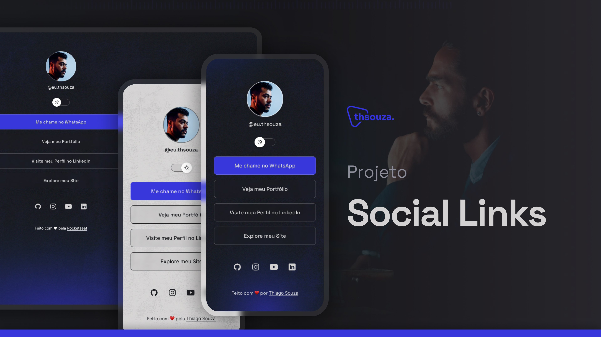

<h1 align="center"> Social Links </h1>

O Projeto Social Links é uma plataforma versátil de gerenciamento de links criada para simplificar a maneira como você compartilha suas redes sociais e recursos online com seu público. Desenvolvido com HTML, CSS e JavaScript, este projeto oferece uma solução elegante e personalizável para organizar e compartilhar seus links importantes de forma eficaz.

  <a href="#-tecnologias">Tecnologias</a>&nbsp;&nbsp;&nbsp;|&nbsp;&nbsp;&nbsp;
  <a href="#-projeto">Projeto</a>&nbsp;&nbsp;&nbsp;|&nbsp;&nbsp;&nbsp;
  <a href="#-layout">Layout</a>&nbsp;&nbsp;&nbsp;|&nbsp;&nbsp;&nbsp;
  <a href="#memo-licença">Licença</a>

  

 

  

## 🚀 Tecnologias

Este projeto foi desenvolvido com as seguintes tecnologias:

- HTML, CSS
- JavaScript
- Figma
- Git e GitHub

## 💻 Projeto

Este projeto oferece uma solução elegante e personalizável para organizar e compartilhar seus links importantes de forma eficaz.

## 🔖 Layout

Para visualizar o layout completo do projeto, acesse [ESTE LINK](https://www.figma.com/file/4b2aCGOWkI8g1SDcRsm2yo/Projeto-Social-Links?type=design&node-id=1437%3A191&mode=design&t=MzP0NZ401M7v51v5-1).

## :memo: Licença

Esse projeto está sob a licença MIT.

---

Feito com ♥ by [Thiago Souza](https://thsouza.com.br/) :wave: